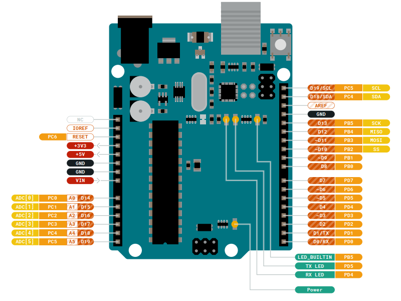

<h2 align="center">~~~ :parachute: Exploring the Embedded World with an AVR ATmega328p chip :jack_o_lantern: ~~~</h2>

<h6>:anchor: Table of contents</h6>
<ol>
  <li><a href="https://github.com/theparotta/avr_atmega328/tree/trunk/blink_LED">blink_LED</a></li>
  <li><a href="https://github.com/theparotta/avr_atmega328/tree/trunk/pov_toy">POV_toy (persistence-of-vision)</a></li>
</ol>

---

<h6>AVR ATmega328p Pins Naming & Functions</h6>

<h6>ATmega328p Pins to Arduino Pins Mapping</h6>

